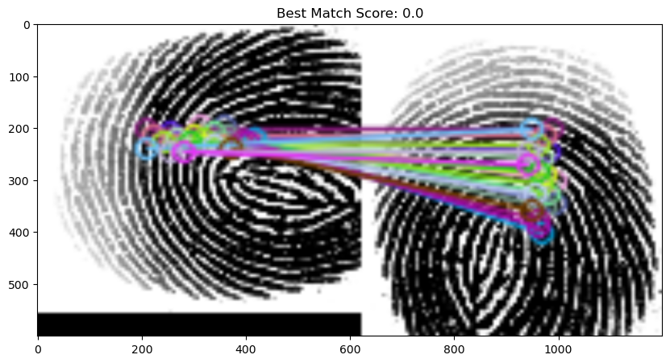

# ORB (Oriented FAST and Rotated BRIEF)
ORB adalah algoritma dalam visi komputer yang digunakan untuk mendeteksi dan mencocokan fitur( feature matching).
- FAST (Feature from Accelerated Segment Test) untuk menemukan titik-titik khas pada gambar. untuk setiap piksel (IP) algoritma mengambil 16 piksel yang mengelilingi dalam bentuk lingkaran.
- BRIEF (Binery Robust Independent Elementary Features) yang mengubah area di sekitar titik fitur (keypoint) menjadi kode biner (0 dan 1) untuk bisa dibandingkan dengan cepat antar gambar.
#Dataset
pada percobaan ini menggunakan dataset publik di [Kaggle](kaggle.com) sebanyak 6000 dataset gambar 
# Output 

#Referensi
[ImranNawar](https://github.com/ImranNawar/orb_feature_descriptor)
